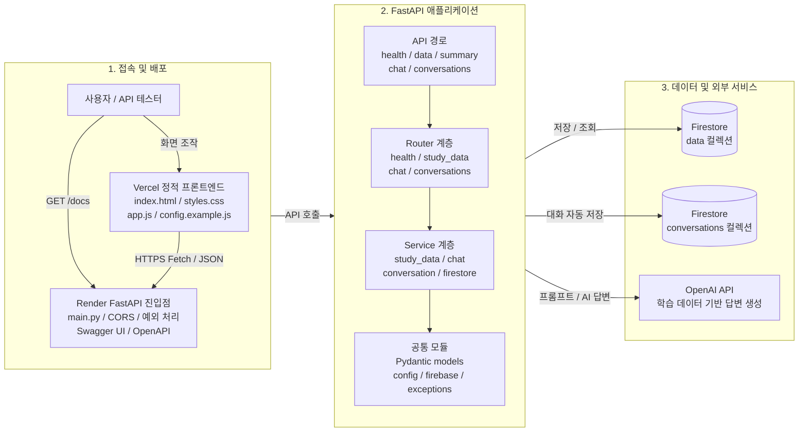
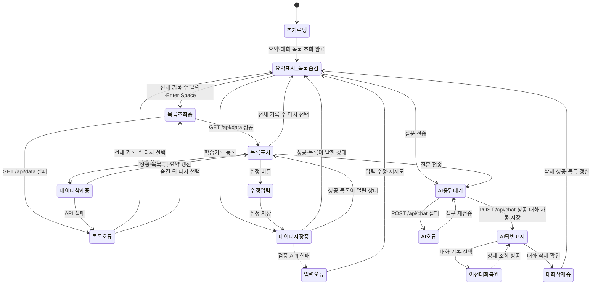
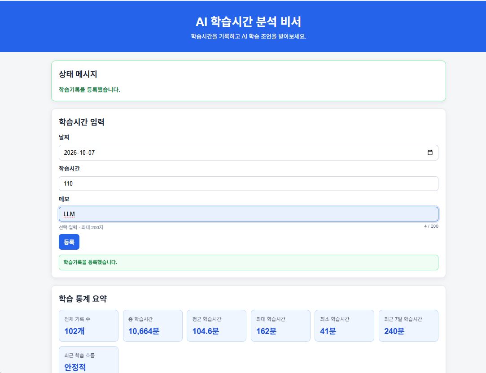
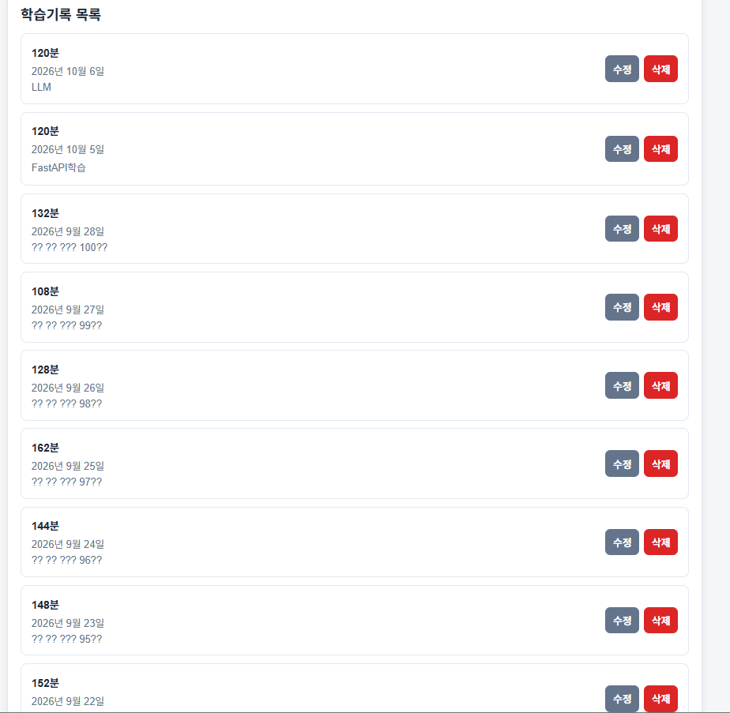

# AI 학습시간 분석 비서

학습시간 시계열 데이터를 기록·분석하고, 저장된 학습 이력을 바탕으로 AI 학습 조언을 제공하는 웹서비스입니다.
HTML, CSS, Vanilla JavaScript 기반 정적 화면에서 학습시간과 대화를 관리하고, FastAPI와 Firestore에 데이터를 저장하며 OpenAI API로 한국어 학습 코칭 답변을 생성합니다.

## 주요 기능

- 학습시간 데이터 생성, 목록 조회, 수정, 삭제
- 전체 학습시간 및 최근 7일 학습시간 통계 확인
- 최근 학습 추세 요약
- 저장된 학습 데이터를 바탕으로 AI 학습 조언 생성
- 질문·답변 1쌍 단위 대화 기록 저장, 목록 조회, 상세 조회, 삭제
- AI 답변 생성 후 `conversations` 컬렉션에 질문과 답변 자동 저장
- Firestore 연결 상태 확인
- 외부 서비스 호출 없이 실행 가능한 백엔드 자동 테스트
- GitHub Actions 기반 백엔드 검증

## 기술 스택

- Backend: Python, FastAPI, Uvicorn
- Database: Firebase Firestore
- AI: OpenAI API
- Frontend: HTML, CSS, Vanilla JavaScript, Fetch API
- Test/CI: pytest, GitHub Actions
- Deploy: Render, Vercel

## 프로젝트 구조

```text
.
├── backend/
│   ├── main.py
│   ├── requirements.txt
│   └── tests/
├── frontend/
│   ├── index.html
│   ├── styles.css
│   ├── app.js
│   └── config.example.js
├── docs/
├── scripts/
├── .github/
│   └── workflows/
├── .env.example
└── README.md
```

## 시스템 설계

### 시스템 구조도

배포 위치와 주요 모듈, API 처리 계층 및 외부 서비스의 관계를 나타냅니다. 화살표는 호출·의존 방향이며 API 응답은 호출 경로의 역방향으로 반환됩니다.




구조도는 왼쪽에서 오른쪽으로 `접속·배포 → FastAPI 애플리케이션 → 데이터·외부 서비스` 순서로 읽습니다. 프론트엔드의 `app.js`가 Render API를 호출하고 Router가 요청을 구분한 뒤 Service가 비즈니스 로직과 외부 연동을 수행합니다.

| Router | 주요 API | 연결 Service | 저장소·외부 연동 |
| --- | --- | --- | --- |
| `health` | `GET /`, `GET /api/health/firestore` | `firestore_service` | Firebase·Firestore 연결 확인 |
| `study_data` | `GET·POST /api/data`, `PUT·DELETE /api/data/{document_id}`, `GET /api/data/summary` | `study_data_service`, `firestore_service` | Firestore `data` 컬렉션 |
| `chat` | `POST /api/chat` | `chat_service`, `study_data_service`, `conversation_service` | Firestore 학습 데이터, OpenAI API, `conversations` 컬렉션 |
| `conversations` | `GET·POST /api/conversations`, `GET·DELETE /api/conversations/{document_id}` | `conversation_service`, `firestore_service` | Firestore `conversations` 컬렉션 |

프론트엔드의 AI 질문 흐름은 `POST /api/chat`만 호출합니다. `chat_service`가 최신 학습기록과 통계를 조회하고 OpenAI 답변을 생성한 뒤 `conversation_service`로 질문·답변 한 쌍을 자동 저장합니다. `POST /api/conversations`는 Swagger 또는 별도 API 클라이언트에서 대화를 직접 저장할 때 사용하는 경로입니다.

### 화면 상태전이도



상태전이도에서 학습기록 목록은 초기 화면에 표시되지 않습니다. 전체 기록 수 카드를 선택할 때마다 최신 목록을 다시 조회하며, 목록이 열린 상태의 등록·수정·삭제 후에는 목록과 요약을 함께 갱신합니다.

## Python 버전 정책

- 권장 및 로컬 검증: Python 3.12.x
- 허용: Python 3.11 이상
- 검증 제외: Python 3.14

시스템 기본 Python 버전과 관계없이, 이 프로젝트는 프로젝트 루트의 `.venv` 가상환경에서 실행하는 것을 권장합니다.

## 환경변수 준비

루트의 `.env.example`을 참고하여 로컬 `.env` 또는 배포 서비스의 환경변수 설정에 다음 값을 등록합니다.

- `OPENAI_API_KEY` — 필수
- `OPENAI_MODEL` — 선택 사항, 기본값 `gpt-4o-mini`
- `FIREBASE_PROJECT_ID` — 필수, 백엔드 전용
- `FIREBASE_CLIENT_EMAIL` — 필수, 백엔드 전용
- `FIREBASE_PRIVATE_KEY` — 필수, 백엔드 전용
- `FRONTEND_ORIGIN` — 선택 사항. 로컬 기본 허용 출처는 `http://127.0.0.1:5500`입니다. Render 배포 환경에서는 실제 Vercel Origin인 `https://frontend-sigma-rouge-14.vercel.app`으로 설정해야 합니다.

실제 OpenAI API 키, Firebase 개인키, 서비스 계정 정보 등 비밀값은 README, 소스 코드, 프론트엔드 코드, Git 저장소에 포함하지 않습니다.

## 백엔드 로컬 실행

프로젝트 루트에서 Python 3.12 기반 가상환경을 만들고 의존성을 설치합니다.

```powershell
py -3.12 -m venv .venv
.\.venv\Scripts\Activate.ps1

python --version
python -m pip install --upgrade pip
python -m pip install -r backend/requirements.txt
```

백엔드를 실행합니다.

```powershell
cd backend
..\.venv\Scripts\python.exe -m uvicorn main:app --reload --port 8001
```

실행 후 다음 주소에서 확인할 수 있습니다.

```text
API 기본 상태: http://127.0.0.1:8001/
Swagger UI: http://127.0.0.1:8001/docs
```

PowerShell 실행 정책 때문에 가상환경 활성화가 차단되면 다음 명령을 한 번 실행한 뒤 다시 활성화합니다.

```powershell
Set-ExecutionPolicy -ExecutionPolicy RemoteSigned -Scope CurrentUser
```

## 프론트엔드 로컬 실행

백엔드가 실행 중인 상태에서 별도 PowerShell을 열고 정적 프론트엔드 서버를 실행합니다.

```powershell
cd frontend
..\.venv\Scripts\python.exe -m http.server 5500
```

브라우저에서 다음 주소에 접속합니다.

```text
http://127.0.0.1:5500
```

프론트엔드는 별도 설정이 없으면 다음 주소를 API 기본 주소로 사용합니다.

```text
https://ai-native-m-2.onrender.com
```

다른 백엔드 주소를 사용할 경우 `window.APP_CONFIG.API_BASE_URL` 값을 설정해 변경할 수 있습니다. 예시는 `frontend/config.example.js`에서 확인할 수 있습니다.

```js
window.APP_CONFIG = {
  API_BASE_URL: "https://ai-native-m-2.onrender.com"
};
```

현재 `frontend/app.js`와 `frontend/config.example.js`의 기본 API 주소는 배포된 Render 백엔드를 가리킵니다. 필요하면 `window.APP_CONFIG.API_BASE_URL`로 실행 환경별 주소를 재정의할 수 있습니다.

`frontend/config.example.js`는 예시 파일이며 `index.html`에서 자동으로 로드하지 않습니다. 런타임에 API 주소를 재정의하려면 위 설정이 `frontend/app.js`보다 먼저 실행되도록 인라인 설정 또는 별도 설정 스크립트로 주입합니다.

프론트엔드는 별도 패키지 설치나 빌드 과정 없이 정적 파일로 실행됩니다.
실제 OpenAI API 키, Firebase 인증정보, 서비스 계정 정보는 프론트엔드 코드에 넣지 않습니다.

## macOS/Linux 보조 실행 명령

```bash
python3.12 -m venv .venv
source .venv/bin/activate

python --version
python -m pip install --upgrade pip
python -m pip install -r backend/requirements.txt

cd backend
python -m uvicorn main:app --reload --port 8001
```

프론트엔드는 별도 터미널에서 실행합니다.

```bash
cd frontend
python -m http.server 5500
```

## 실행 보조 스크립트

Windows PowerShell에서는 프로젝트 루트에서 다음 스크립트를 사용할 수 있습니다.

```powershell
.\scripts\setup_venv.ps1
.\scripts\run_backend.ps1
```

## API 엔드포인트

| 메서드 | 경로 | 기능 |
| --- | --- | --- |
| `GET` | `/` | API 기본 상태 확인 |
| `GET` | `/api/health/firestore` | Firestore 연결 상태 확인 |
| `POST` | `/api/chat` | 학습 데이터 기반 AI 답변 생성 및 대화 자동 저장 |
| `POST` | `/api/conversations` | 질문·답변 대화 기록 저장 |
| `GET` | `/api/conversations` | 대화 기록 목록 조회 |
| `GET` | `/api/conversations/{document_id}` | 특정 대화 기록 조회 |
| `DELETE` | `/api/conversations/{document_id}` | 특정 대화 기록 삭제 |
| `POST` | `/api/data` | 학습시간 데이터 생성 |
| `GET` | `/api/data` | 학습시간 데이터 목록 조회 |
| `PUT` | `/api/data/{document_id}` | 학습시간 데이터 수정 |
| `DELETE` | `/api/data/{document_id}` | 학습시간 데이터 삭제 |
| `GET` | `/api/data/summary` | 학습시간 요약 통계 조회 |

주의: `POST /api/conversations`는 Swagger 또는 별도 API 클라이언트에서 직접 대화 기록을 저장할 때 사용할 수 있는 API입니다.
프론트엔드의 AI 질문 흐름에서는 중복 저장을 방지하기 위해 `POST /api/chat`만 호출합니다.
`/api/chat` 처리 과정에서 백엔드가 질문과 답변을 `conversations` 컬렉션에 자동 저장합니다.

## 주요 데이터 구조

### 학습시간 데이터

`data` 컬렉션에는 다음 형태의 문서가 저장됩니다.

```json
{
  "date": "2025-01-10",
  "value": 120,
  "memo": "FastAPI 기초 학습",
  "created_at": "2025-01-10T12:00:00"
}
```

### 대화 기록

`conversations` 컬렉션에는 질문 1개와 답변 1개가 한 문서로 저장됩니다.

```json
{
  "message": "최근 학습 흐름이 어때?",
  "answer": "최근 기록을 보면...",
  "created_at": "2025-01-10T12:00:00"
}
```

## 테스트

프로젝트 루트에서 문법 검사를 실행합니다.

```powershell
.\.venv\Scripts\python.exe -m compileall -q backend
```

전체 백엔드 테스트는 다음과 같이 실행합니다.

```powershell
cd backend
..\.venv\Scripts\python.exe -m pytest tests -v
```

현재 로컬 검증 결과는 다음과 같습니다.

```text
58 passed, 1 warning
```

테스트에서는 Firebase Admin SDK, Firestore, OpenAI 호출을 mock 처리하므로 실제 외부 API 요청이나 DB 변경이 발생하지 않습니다.

## GitHub Actions CI

- Workflow: `.github/workflows/backend-tests.yml`
- Python: 3.12
- 실행 조건: `main` 브랜치 push, `main` 대상 pull request
- 실행 단계:
  - 의존성 설치
  - `python -m compileall -q backend`
  - 전체 pytest 실행
- 원격 실행 결과: 마지막 확인 당시 `Backend Tests` workflow 성공, `57 passed`

현재 로컬 검증 결과는 Python 3.12.x 프로젝트 가상환경 기준 `58 passed, 1 warning`입니다. 원격 실행 성공 확인 이후 테스트가 추가되어 현재 로컬 테스트 수는 58개이며, 다음 push 또는 pull request에서 최신 테스트 수 기준으로 다시 확인합니다.
저장소 소유자와 이름이 확정되지 않아 CI 상태 배지는 추가하지 않았습니다.

## Render Python 버전

Render 백엔드는 로컬 검증 환경과 같은 Python 3.12 기준으로 배포되어 있습니다. 설정을 변경하거나 재배포할 때는 배포 로그에서 실제 Python 버전을 확인합니다.

Render Web Service의 Root Directory는 `backend`를 기준으로 사용합니다.

Render 무료 티어를 사용할 경우 서비스가 유휴 상태에서 중지되어 첫 요청 응답이 지연될 수 있습니다. 첫 요청에서 콜드 스타트가 발생하면 잠시 기다린 뒤 다시 확인하세요.

## 배포 상태

Render 백엔드와 Vercel 프론트엔드 배포가 완료되었으며, 실제 Vercel Origin의 CORS 프리플라이트도 정상 동작합니다.

- 백엔드 배포 상태: 완료
- Render 서비스 상태: Live
- Render 백엔드 URL: https://ai-native-m-2.onrender.com
- Swagger URL: https://ai-native-m-2.onrender.com/docs
- 프론트엔드 배포 상태: 완료 (`READY`)
- Vercel 프론트엔드 URL: https://frontend-sigma-rouge-14.vercel.app

프론트엔드의 기본 API 주소는 `https://ai-native-m-2.onrender.com`으로 설정되어 있습니다. 관련 설정 파일은 `frontend/app.js`와 `frontend/config.example.js`입니다.

배포 검증 결과는 다음과 같습니다.

- Render의 `/`, `/docs`, `/api/health/firestore`, `/api/data`, `/api/data/summary`, `/api/conversations`: HTTP 200
- Vercel의 `/`, `/app.js`, `/styles.css`: HTTP 200
- 배포된 `app.js`: Render 백엔드 URL 사용 확인
- Vercel CLI 로컬 메타데이터: `frontend/.gitignore`의 `.vercel` 규칙으로 Git 추적 제외
- CORS: Vercel Origin의 GET·POST 프리플라이트가 HTTP 200이며 `Access-Control-Allow-Origin`이 실제 Vercel Origin과 일치

최종 완료 전에는 다음 작업이 남아 있습니다.

- 새 학습기록 목록 토글을 실제 브라우저에서 클릭·키보드로 최종 확인
- 대화 기록 상세·삭제 동작 최종 확인

## 제출용 스크린샷

- 학습시간 등록 화면

 
=======

- 데이터 요약과 질문·답변이 보이는 AI 채팅 화면( 이전대화 불러오기 포함)

 
======

- 학습DATA 편집 화면


======

## 보안 주의사항

- 실제 API 키와 Firebase 서비스 계정 정보는 Git에 커밋하지 않습니다.
- 프론트엔드 코드에는 공개되어도 안전한 설정값만 둡니다.
- OpenAI API 키와 Firebase 인증정보는 백엔드 환경변수로만 관리합니다.
- `.env` 파일은 Git 추적 대상에서 제외합니다.
- 배포 환경에서는 `FRONTEND_ORIGIN`을 실제 프론트엔드 주소로 설정해 CORS 허용 범위를 제한합니다.


## 현재 검증 상태 요약

- 백엔드 API 구현 완료
- Firestore CRUD 구조 구현 완료
- OpenAI 연동 구조 구현 완료
- 학습시간 CRUD API 구현 완료
- 학습시간 요약 API 구현 완료
- AI 채팅 및 대화 자동 저장 구현 완료
- 대화 기록 조회·상세·삭제 API 구현 완료
- Vanilla JavaScript 기반 프론트엔드 구현 완료
- 백엔드 로컬 테스트 58개 통과, 경고 1건
- GitHub Actions 백엔드 CI 성공
- Render 백엔드 배포 완료
- Vercel 프론트엔드 배포 완료
- 새 목록 토글의 브라우저 수동 검증과 최종 제출 자료 정리는 진행 예정
